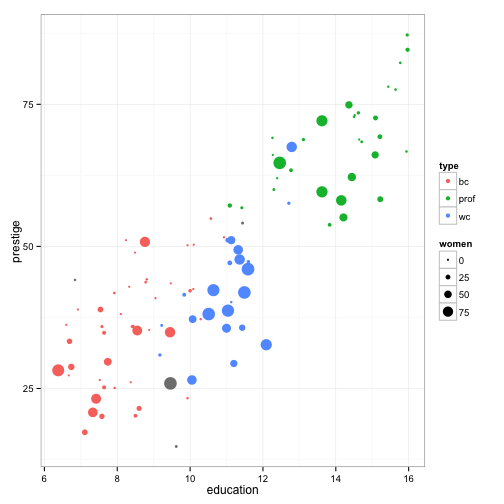

## The Census Data


With this simple Shiny application (http://katiter.shinyapps.io/project_prestige), we let the user explore the Canadian census data for occupations, available in the `car` package.


```r
Prestige <- car::Prestige
head(Prestige)
```

```
##                     education income women prestige census type
## gov.administrators      13.11  12351 11.16     68.8   1113 prof
## general.managers        12.26  25879  4.02     69.1   1130 prof
## accountants             12.77   9271 15.70     63.4   1171 prof
## purchasing.officers     11.42   8865  9.11     56.8   1175 prof
## chemists                14.62   8403 11.68     73.5   2111 prof
## physicists              15.64  11030  5.13     77.6   2113 prof
```
 

---
## Variables of Interest

The user can explore how these factors correlate with the perceived respectability of an occupation:

- Gender
- Education
- Salary

---

## A Sample Plot

For example, how does occupational prestige correlate with years of education? 

 

---

## Another Sample Plot
In the Shiny app, you can also explore by the percentage of women or by job type.


 


---

## A Simple Model

After exploring the data through the app, we can build a simple model to describe occupational prestige.


```
## 
## Call:
## lm(formula = prestige ~ education + income, data = Prestige)
## 
## Residuals:
##      Min       1Q   Median       3Q      Max 
## -19.4040  -5.3308   0.0154   4.9803  17.6889 
## 
## Coefficients:
##               Estimate Std. Error t value Pr(>|t|)    
## (Intercept) -6.8477787  3.2189771  -2.127   0.0359 *  
## education    4.1374444  0.3489120  11.858  < 2e-16 ***
## income       0.0013612  0.0002242   6.071 2.36e-08 ***
## ---
## Signif. codes:  0 '***' 0.001 '**' 0.01 '*' 0.05 '.' 0.1 ' ' 1
## 
## Residual standard error: 7.81 on 99 degrees of freedom
## Multiple R-squared:  0.798,	Adjusted R-squared:  0.7939 
## F-statistic: 195.6 on 2 and 99 DF,  p-value: < 2.2e-16
```

--- 

## Thanks :)


